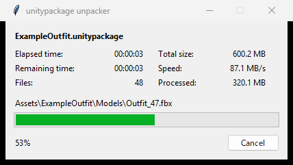

# unitypackage unpacker

[日本語](README.md)

A tool that unpacks a `.unitypackage` from the Windows Explorer right-click menu, into the same folders and file names Unity creates when it imports the package.

Opening a `.unitypackage` with 7-Zip or a similar tool shows one folder per asset, named after its GUID, so you cannot tell which file is which. Each of those folders holds a `pathname` file with the asset's original path. This tool reads it and puts every file back at that path.



## Features

- It never connects to the network. The tool has no networking code, so nothing about what you unpack, file names included, is sent anywhere.
- It is a single Python file (about 780 lines) that runs on the standard library alone. You can read all of it to check what it does.
- There are no settings. Choose it from the right-click menu and it starts unpacking; it does not show a message when it is done.

## Usage

Right-click a `.unitypackage` and choose **unpack .unitypackage**. A folder with the same name is created next to the package, and the files are unpacked into it with the same layout as in a Unity project, `.meta` files included.

On Windows 11 the entry is under **Show more options**; hold Shift while right-clicking to see it right away. To unpack by drag and drop, drop the package onto the exe.

When a large package takes a while, a progress window opens and closes by itself when done. Files whose path points outside the output folder are skipped.

## Install

1. Download `unitypackage-unpacker-<version>-win64.zip` from [Releases](https://github.com/yqgi/unitypackage-unpacker/releases)
2. Extract the zip anywhere  
   e.g. `%LOCALAPPDATA%\Programs\unitypackage-unpacker`
3. Run `unitypackage-unpacker.exe` and click **Install**

The menu entry runs `unitypackage-unpacker.exe` from that folder, so keep the folder; deleting it breaks the menu. If you move the folder, run the exe from the new place and click **Install** again.

The menu entry is added for the current user only, so no administrator rights are needed.

The exe is not code-signed, so Windows SmartScreen may warn on the first run. Click **More info**, then **Run anyway**. Antivirus software sometimes flags exes built with PyInstaller as well. If that worries you, run from source or build it yourself.

## Uninstall

Run `unitypackage-unpacker.exe`, click **Uninstall**, then delete the folder.

## Run from source

Requires Python 3.10 or later on Windows. Without `rapidgzip`, the standard gzip module is used, which takes a little longer on large packages.

```
pip install -r requirements.txt
python unitypackage_unpacker.py --install
```

From the command line, the result is printed as one line of JSON per package. Add `--gui` to show the progress window.

```
python unitypackage_unpacker.py <file.unitypackage> ... [--out DIR] [--no-meta] [--gui]
python unitypackage_unpacker.py --install
python unitypackage_unpacker.py --uninstall
```

## Build

```
powershell -ExecutionPolicy Bypass -File build.ps1
```

This creates `dist\unitypackage-unpacker\` and the release zip with PyInstaller. Run the tests with `python -m unittest discover -s tests`.

## License

MIT
